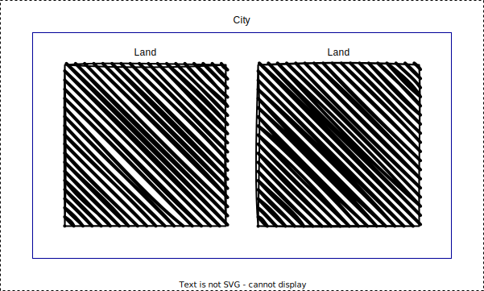

# DevOps + VPC + Terraform

This repository demonstrates a basic example of creating a Virtual Private Cloud (VPC) infrastructure using Terraform,
and then automating the deployment using GitHub Actions.

# 1. Virtual Private Cloud (VPC)

- Imagine as if you're building a house.
- You first need to allocate a particular land (area) to build the house on, because you can't just go anywhere and
	build the house on however many lands you want.
- After you allocate an area, then you start creating your house, garden, guest rooms, etc. within that area (allocated
	space).

- Similarly in AWS Cloud, if you want to create a particular project with specific requirements, with particular address
	range for that particular project, you use a VPC.
- VPC is a logically isolated network space (land) for us to work on.
- You can create multiple VPCs in a single cloud within a region.
- In a VPC you have full control of whatever you do.
- You also assign a specific IP address range, also known as CIDR (Classless Inter-Domain Range).
- Within CIDR, you allocate particular resources.
- Example:
  - **VPC 1:**
    - CIDR -> 10.0.0.0/16
  - **VPC 2:**
    - CIDR -> 20.0.0.0/16
