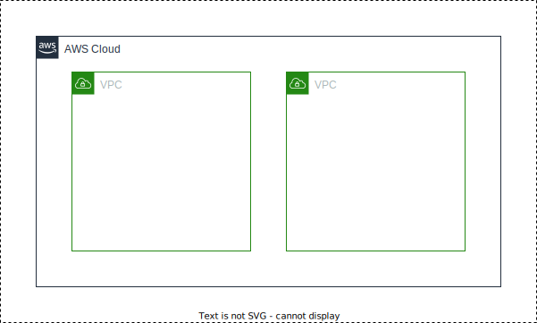
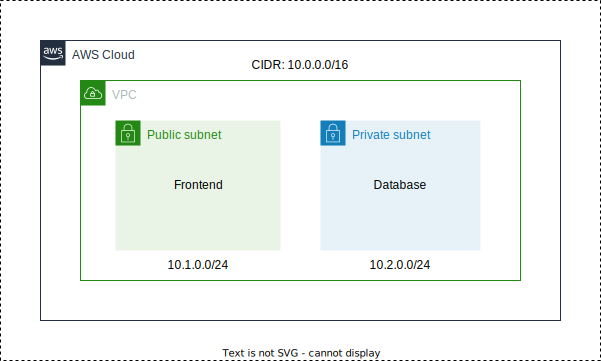
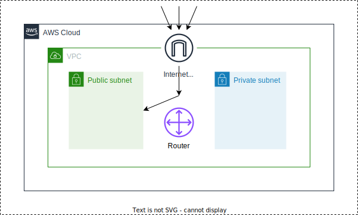

# DevOps + VPC + Terraform

This repository demonstrates a basic example of creating a Virtual Private Cloud (VPC) infrastructure using Terraform,
and then automating the deployment using GitHub Actions.

# 0. Demo

- Two EC2 instances are running.
- The **Load Balancer** has been configured to load either EC2 (A) or EC2 (B) instance, thereby distributing the load
	evenly based on which instance is less loaded.

# 1. Virtual Private Cloud (VPC)

- Imagine as if you're building a house.
- You first need to allocate a particular land (area) to build the house on, because you can't just go anywhere and
	build the house on however many lands you want.
- After you allocate an area, then you start creating your house, garden, guest rooms, etc. within that area (allocated
	space).

- Similarly in AWS Cloud, if you want to create a particular project with specific requirements, with particular address
	range for that particular project, you use a VPC.
- VPC is a logically isolated network space (land) for us to work on.
- You can create multiple VPCs in a single cloud within a region.
- In a VPC you have full control of whatever you do.
- You also assign a specific IP address range, also known as CIDR (Classless Inter-Domain Range).
- Within CIDR, you allocate particular resources.
- Example:
	- **VPC 1:**
		- CIDR -> 10.0.0.0/16
	- **VPC 2:**
		- CIDR -> 20.0.0.0/16

## 1.1. Subnets

- Subnets (sub-net, sub which stands for **division** and net which stands for **network**) is a division of Networks in
	a VPC.
- Some applications may not require direct internet access.
- For example, if we want to create a database, we don't need this database to be accessed publicly, it needs to be in a
	private subnet.
- On the contrary, if we have a frontend application, it has to be in the public subnet, so it can be accessed by
	everyone.
- This can be done because you are not using the whole VPC, you are only using a **small** IP address range.
- A VPC belongs to a **Region**, while a Subnet belongs to **Availability Zone**.

## 1.2. Internet Gateway

- If the resources within the VPC want to have access to the Internet, then they require Internet Gateway.
- Internet Gateway is directly attached to the VPC.
- It allows the external traffic to enter the VPC.

## 1.3. Router

- Routers take care of the routing within the VPC and outside the VPC.
- It basically allows the network traffic to go in the right direction from a subnet or an Internet Gateway.
- For example:
	- Let's say there is some traffic coming through the Internet Gateway.
	- Because Internet Gateway provided the access, the incoming traffic has now entered the VPC.
	- But now it doesn't know which application is supposed to route this traffic to.
	- In order to provide that particular direction to the network traffic, we need to create a **Router**.
	- With the help of Route Table, it will know exactly where to redirect the traffic to.

## 1.4. EC2 and Load Balancers

- EC2 stands for Elastic Compute Cloud, and it is just a logical server.
- Application Load Balancer (ALB) distributes traffic evenly on each EC2 instance.
- Basically, it balances the load between servers, which enables availability (servers always up and running instead of
	having downtime in case of disaster).
- A Load Balancer has a **listener** and **target group**.
- **Listener:**
	- Listener is something where our traffic comes to.
	- So, whenever the traffic comes to the Load Balancer, it will be distributed to the listeners, which are the
		components that receive the request and have a set of rules.
- **Target group:**
	- Target group is something where the request is being redirected to, and these target groups are then attached to our
		EC2 instance.
	- You can have a single target group attached to multiple EC2 instances as well.

## 1.5. Single Tier

- So in what order is all of this supposed to be composed together?

1. Create a VPC.
2. Create subnets.
3. Within the subnets, create EC2 instances.
4. Create Internet Gateway.
5. Create Route Table.
6. Now create a Load Balancer which will balance the load between two servers.
7. Finally, within both servers, create a Security Group within their public subnet.

## 1.6. Project Execution Flow

1. First, write the infrastructure as code to create all of these Cloud components.
2. Deploy it with Terraform.
3. Code gets stored on GitHub.
4. GitHub Actions workflow triggers CI/CD.
5. Code gets deployed to AWS VPC and Components.

- On every merge into the `main` branch, GitHub Actions execute

## 1.7. Terraform Code Structure

- The Terraform structure for this example will be composed out of Modules:
	- **VPC**
	- **EC2**
	- **Security group**
	- **Load balancer**
